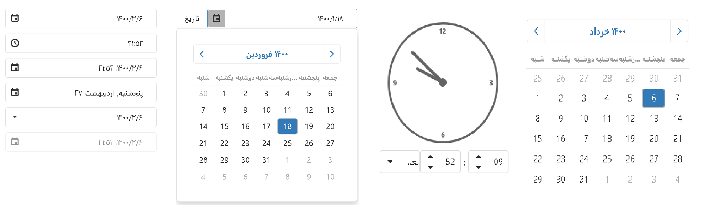
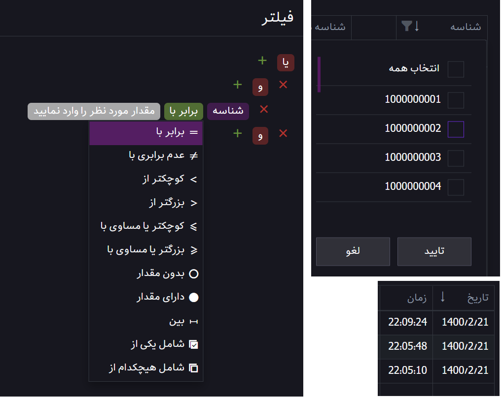

# DevExtreme (Persian Support)

This project has minimal modifications to original DevExtreme version with following features:

- Persian Date Picker
- Localized Persian Messages

For use you must only set locale to 'fa-IR' or set calendar using Intl to persian:

```js
import { locale } from "devextreme/localization";

// ...

function App() {

    // ...

    locale("fa-IR");
    // or
    locale("fa-IR-u-ca-persian-nu-latn");
    // or
    locale("en-US-u-ca-persian-nu-latn");

    // ...
}

```



<br/>
<hr/>
<br/>

DevExtreme is a set of enterprise-ready UI component suites for Angular, React, Vue, and jQuery. It is everything you need to create responsive web apps for touch devices and traditional desktops: data grid, interactive charts, data editors, navigation and multi-purpose widgets. These controls are designed to look great and to provide powerful functionality in any browser.

- Official website: [js.devexpress.com](https://js.devexpress.com)
- Pricing: [js.devexpress.com/buy](https://js.devexpress.com/Buy)
- Licensing: [js.devexpress.com/licensing](https://js.devexpress.com/Licensing)
- Support: [www.devexpress.com/support](https://www.devexpress.com/support)


## Getting Started

- DevExtreme Angular
    - [Create a DevExtreme Angular Application](https://js.devexpress.com/Documentation/Guide/Angular_Components/Getting_Started/Create_a_DevExtreme_Application/)
    - [Add DevExtreme to an Angular Application](https://js.devexpress.com/Documentation/Guide/Angular_Components/Getting_Started/Add_DevExtreme_to_an_Angular_CLI_Application/)

- DevExtreme React
    - [Create a DevExtreme React Application](https://js.devexpress.com/Documentation/Guide/React_Components/Create_a_DevExtreme_Application/)
    - [Add DevExtreme to a React Application](https://js.devexpress.com/Documentation/Guide/React_Components/Add_DevExtreme_to_a_React_Application/)

- DevExtreme Vue
    - [Create a DevExtreme Vue Application](https://js.devexpress.com/Documentation/Guide/Vue_Components/Create_a_DevExtreme_Application/)
    - [Add DevExtreme to a Vue Application](https://js.devexpress.com/Documentation/Guide/Vue_Components/Add_DevExtreme_to_a_Vue_Application/)

- DevExtreme jQuery
    - [Add DevExtreme to a jQuery Application](https://js.devexpress.com/Documentation/Guide/jQuery_Components/Add_DevExtreme_to_a_jQuery_Application/)

## Learn

- [Online Demos](https://js.devexpress.com/Demos/)
- [Documentation](https://js.devexpress.com/Documentation)
- [Examples on GitHub](https://github.com/DevExpress/DevExtreme-examples)
- [YouTube videos](https://www.youtube.com/user/DeveloperExpress/)


## Contributing

See our [Guidelines for Contributing](CONTRIBUTING.md)
